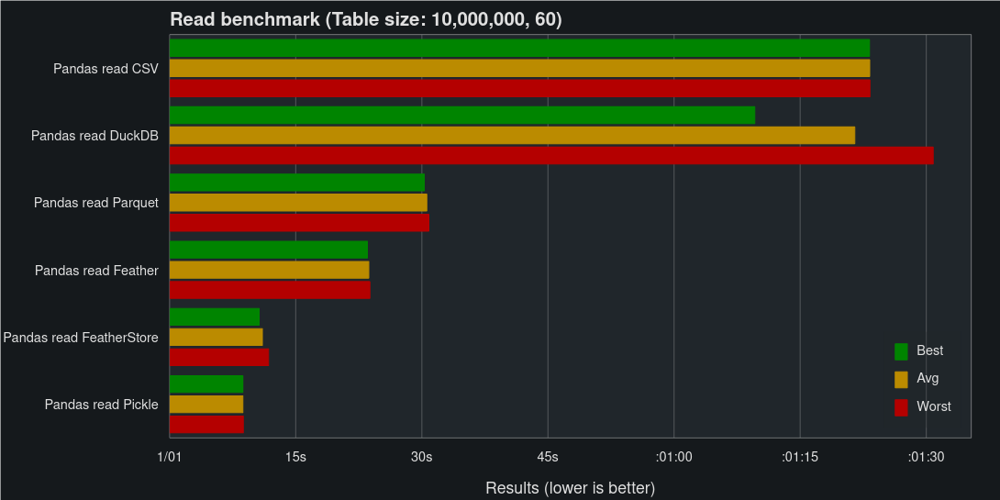
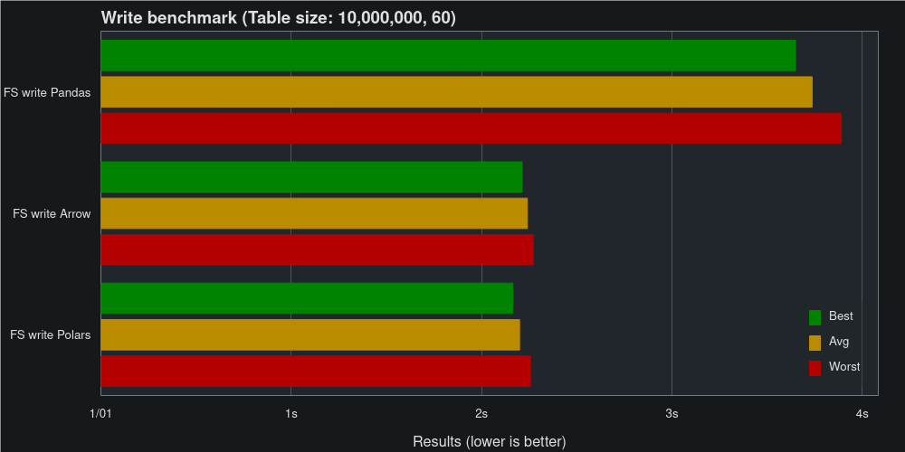
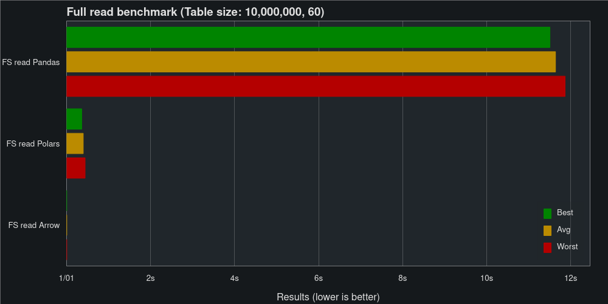
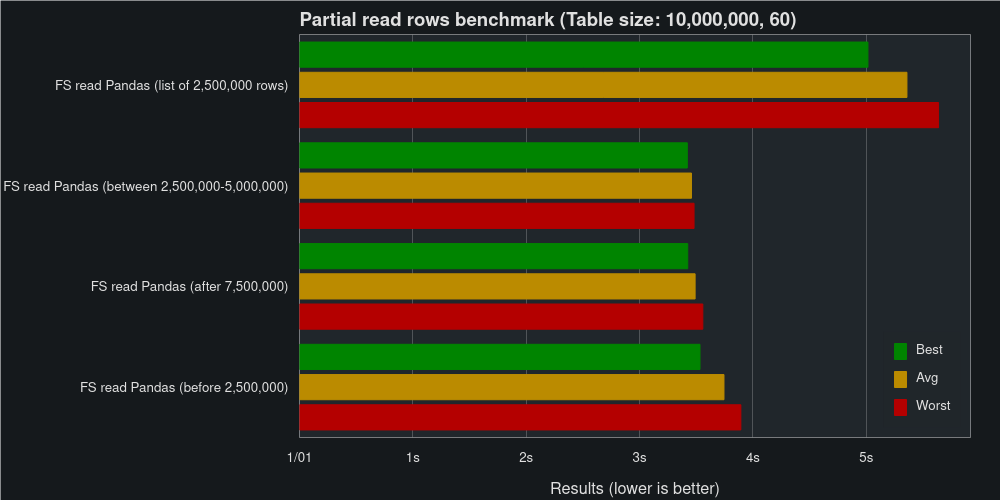

Benchmarks
==========

In this benchmark we'll compare how well FeatherStore, Feather, Parquet, CSV,
Pickle and DuckDB perform when reading and writing Pandas DataFrames.

The benchmark ran on the following computer:

* CPU: Intel© Core™ i5-11600
* RAM: 48 GB DDR4 (3200 MHz)
* SSD: 1 TB M.2 NVMe (3470/3000 Read/Write MBps)
* GPU: NVIDIA GeForce GTX 1060 6GB (Not used during the benchmark)

VS Other Libraries
++++++++++++++++++

The code used for these benchmarks can be found `here <https://github.com/hakonmh/featherstore/blob/master/benchmarks/external.py>`_.

First Dataset
--------------

Let's start small, the first dataset is made up of 6,000 fields of random
data with the shape of 1,000 rows and 6 columns. The data consists of strings,
ints, uints, bools, floats, and datetime, with one column of each data type.

.. image:: images/write_first.png
    :width: 750
    :align: center

.. image:: images/read_first.png
    :width: 750
    :align: center

As you can see, for small DataFrames, Pickle is the fastest solution. While
FeatherStore is around the middle of the pack for both reads and writes.

Second Dataset
--------------

The second dataset is made up of 600 million fields of random data in the shape
10 million rows and 60 columns (Approx. 6.4 Gb of data when stored as CSV).
The data consists of strings, ints, uints, bools, floats, and datetimes, with
10 columns of each data type.

.. image:: images/write_second.png
    :width: 750
    :align: center

Here's where FeatherStore really shines, matching Pickle on read speed and
Feather on write speed.

Internal Benchmarks
+++++++++++++++++++

The code used for these benchmarks (and more) can be found `here <https://github.com/hakonmh/featherstore/blob/master/benchmarks/internal.py>`_.

Pandas vs Polars and Arrow
--------------------------

In addition to supporting reading and writing Pandas DataFrames, FeatherStore
also supports reading and writing Polars DataFrames and PyArrow Tables.
These two data structures use the Apache Arrow Columnar Format as a memory
model, allowing reads and writes without serializing and deserializing to and
from Pandas.

We will benchmark using the second dataset, comparing reading and writing
the dataset as Pandas DataFrame, Polars DataFrame, and PyArrow Table
using FeatherStore.

Skipping serialization makes FeatherStore extremely fast when reading to Arrow
and Polars. It's not easy to see based on the chart, but read Arrow is clocking
in at just 4.36 ms, while read Polars takes 362 ms.

Predicate Filtering
-------------------

In addition to the performance given to us by the underlying Feather files,
FeatherStore partitions our data into multiple files. This allows us to read
parts of the data without reading the full table, saving both time and memory
usage.

.. image:: images/read_cols_internal.png
    :width: 750
    :align: center

Reading 25 % of the columns cuts the time to read Pandas from 11.5 s to 4.8 s.
Similar improvements can also be seen when reading Polars.

Reading 25 % of the rows takes between 3.5 s and 5.0 s when reading Pandas,
dependent on how you read them (list of rows vs range query).

It should be noted that the performance when filtering rows is dependent
on the partition size used. Smaller partitions allow us to skip more rows
when reading, with the trade-off being slower performance when doing full table
reads and writes. In these benchmarks, the default 128 Mb was used as the
partition size.