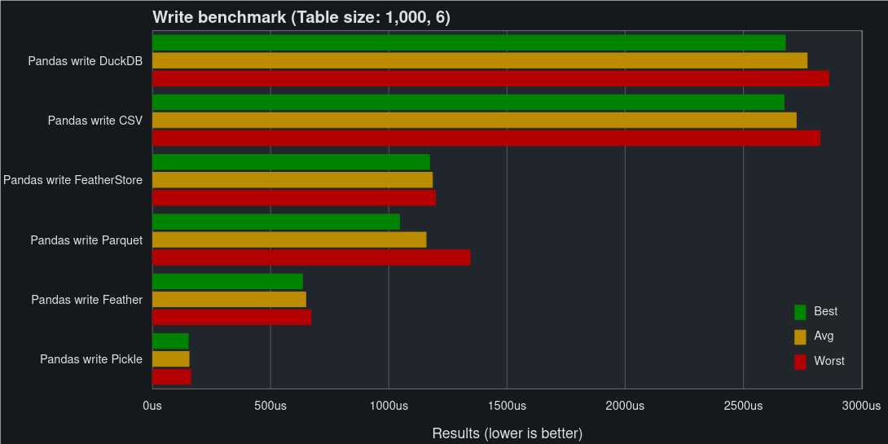
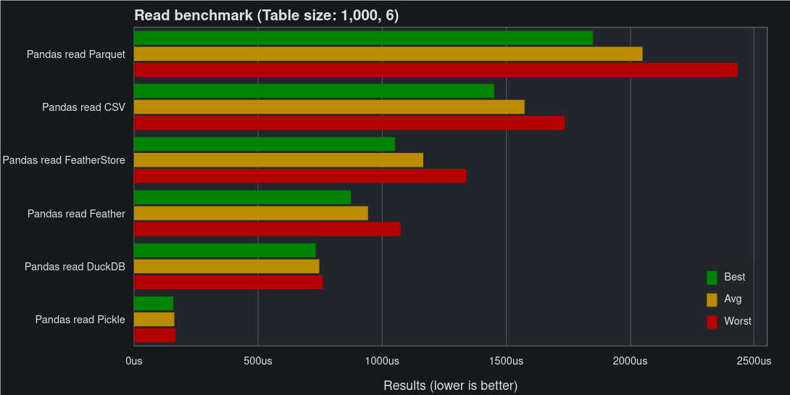
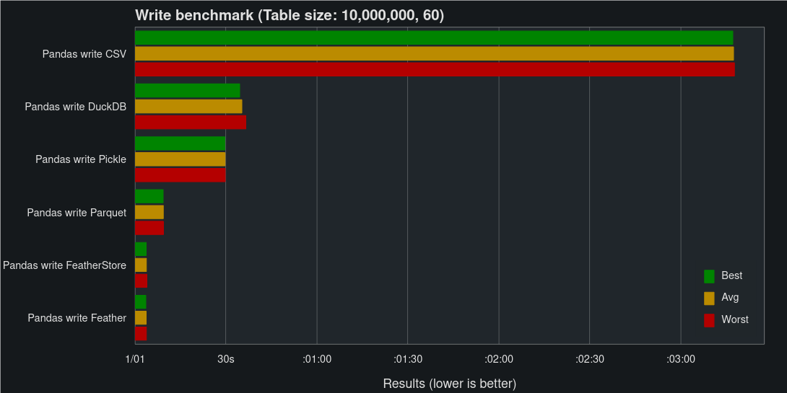
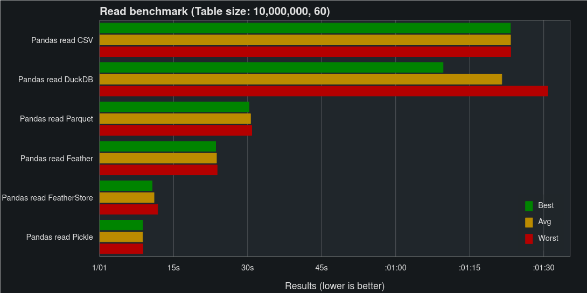
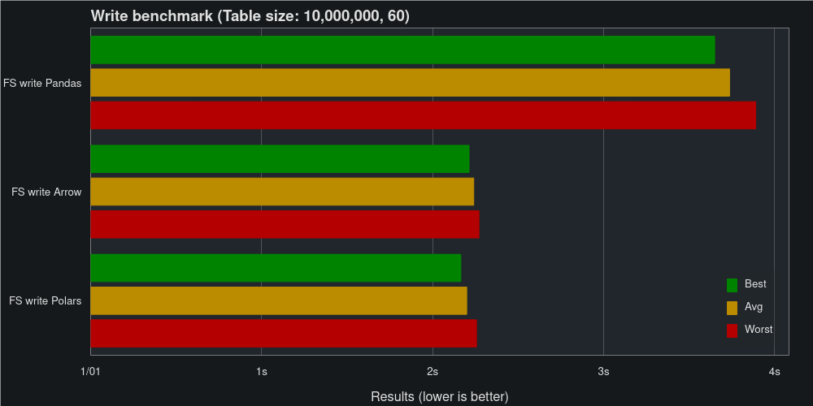
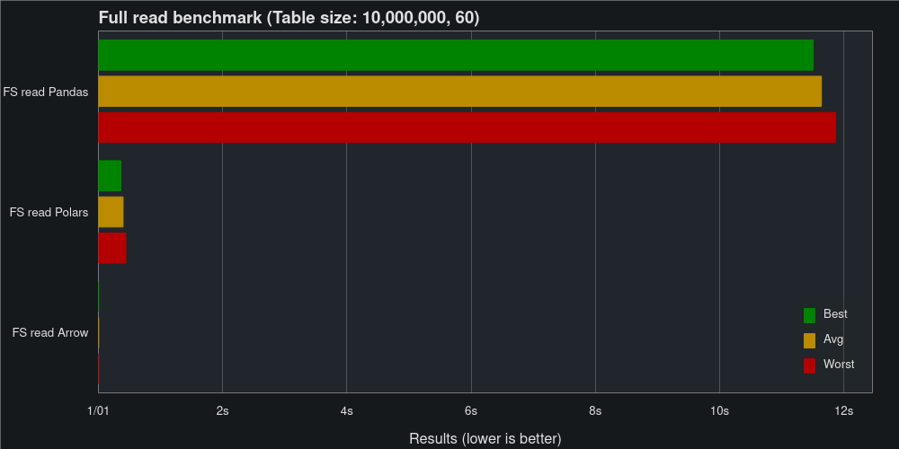
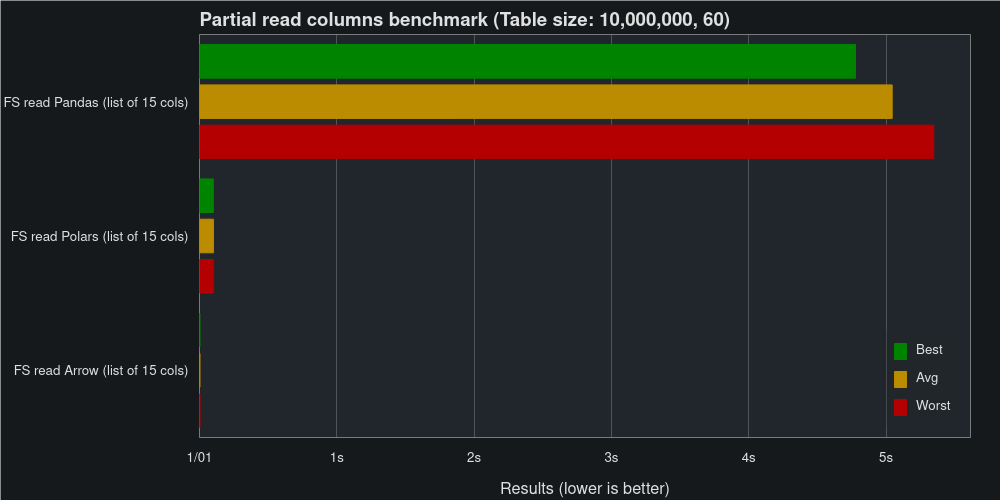
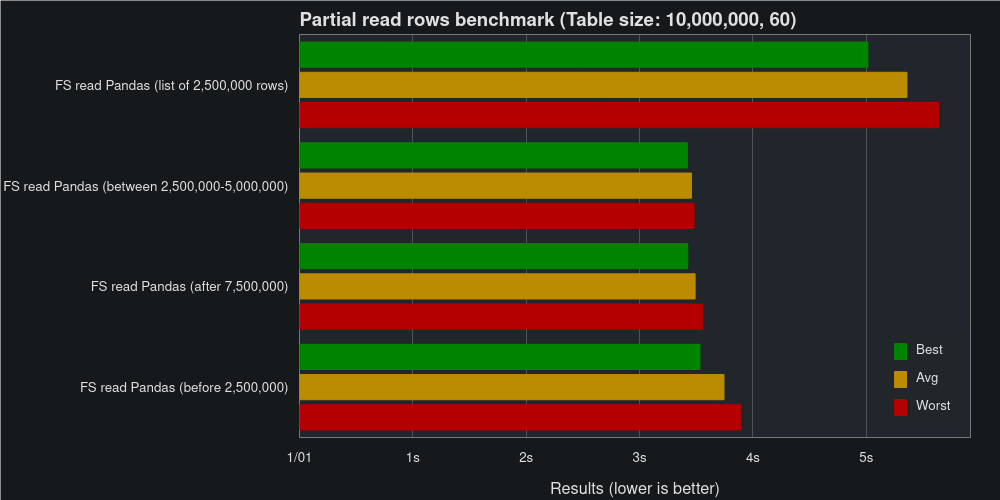

Benchmarks
==========

This page compares FeatherStore, Feather, Parquet, CSV, Pickle, and DuckDB
when reading and writing Pandas DataFrames.

The benchmarks were run on the following hardware:

* CPU: Intel© Core™ i5-11600
* RAM: 48 GB DDR4 (3200 MHz)
* SSD: 1 TB M.2 NVMe (3470/3000 MB/s read/write)
* GPU: NVIDIA GeForce GTX 1060 6GB (not used during the benchmark)

Compared with other libraries
+++++++++++++++++++++++++++++

The code for the format comparison is in
`benchmarks/format_comparison.py <https://github.com/hakonmh/featherstore/blob/master/benchmarks/format_comparison.py>`_.

First dataset
-------------

The first dataset is small: 6,000 random fields in a table of 1,000 rows and 6
columns. It includes strings, ints, uints, bools, floats, and datetimes, with
one column of each type.

For small DataFrames, Pickle is the fastest option. FeatherStore is neither
the fastest nor the slowest for reads or writes.

Second dataset
--------------

The second dataset has 600 million random fields: 10 million rows and 60 columns
(about 6.4 GB when stored as CSV). It includes strings, ints, uints, bools,
floats, and datetimes, with 10 columns of each type.

Here's where FeatherStore really shines, matching Pickle on read speed and
Feather on write speed.

Table operation benchmarks
++++++++++++++++++++++++++

The code for the table-operation benchmarks is in
`benchmarks/table_operations.py <https://github.com/hakonmh/featherstore/blob/master/benchmarks/table_operations.py>`_.

Pandas vs Polars and Arrow
--------------------------

In addition to Pandas DataFrames, FeatherStore can read and write Polars
DataFrames and PyArrow Tables. These two structures use the Apache Arrow
Columnar Format as a memory model, so reads and writes can skip serializing and
deserializing through Pandas.

The charts below use the second dataset and compare reading and writing it as a
Pandas DataFrame, a Polars DataFrame, and a PyArrow Table with FeatherStore.

Skipping serialization makes FeatherStore very fast when reading to Arrow and
Polars. Reading to Arrow takes 4.36 ms; reading to Polars takes 362 ms. The
chart scale makes that difference hard to see.

Predicate filtering
-------------------

On top of the performance of the underlying Feather files, FeatherStore
partitions data into multiple files. That lets you read part of a table without
loading all of it, which saves both time and memory.

Reading 25% of the columns cuts Pandas read time from 11.5 s to 4.8 s. Polars
reads improve by a similar amount.

Reading 25% of the rows takes between 3.5 s and 5.0 s for Pandas, depending on
whether you pass a list of rows or a range query.

Row-filtering performance depends on partition size. Smaller partitions skip
more rows when reading, at the cost of slower full-table reads and writes.
These benchmarks used the default partition size of 128 MB.
