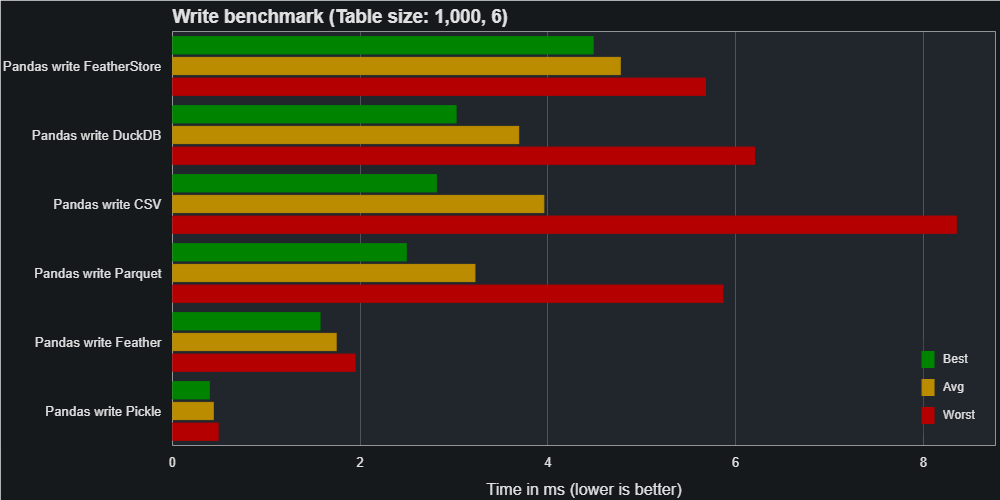
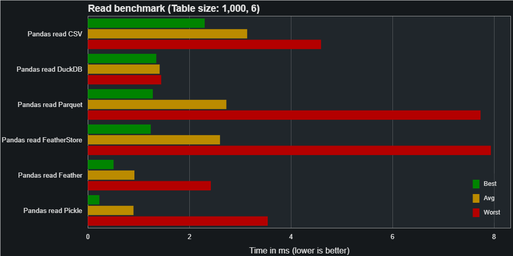
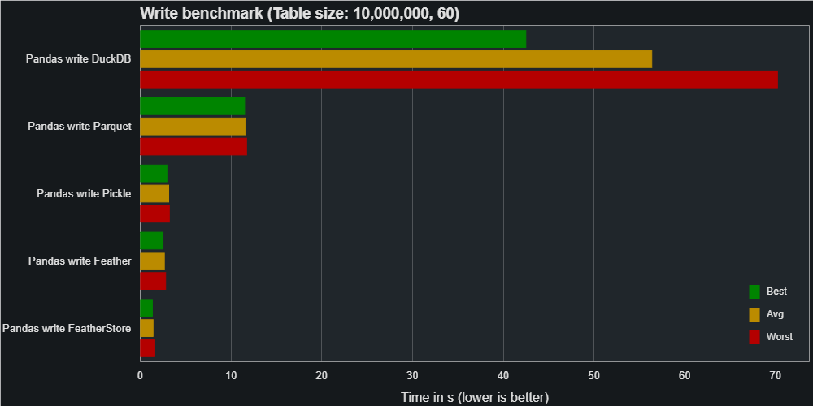
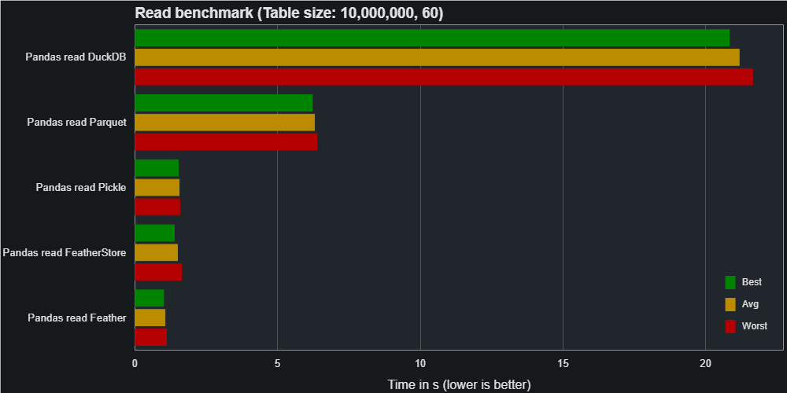
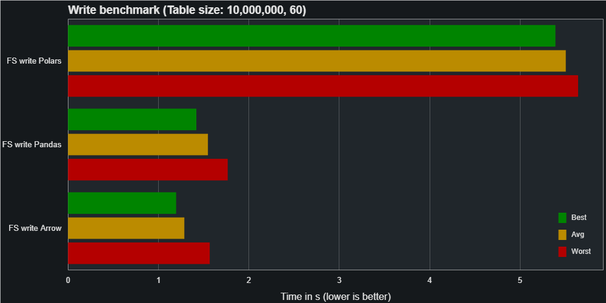
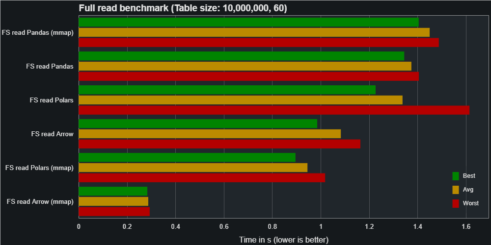
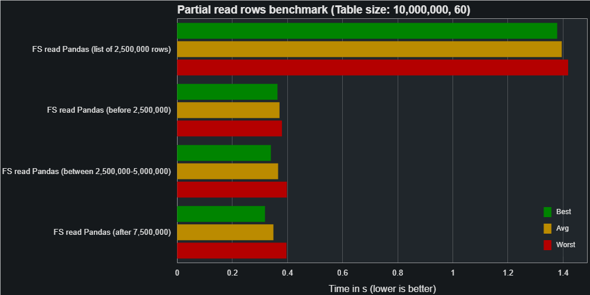
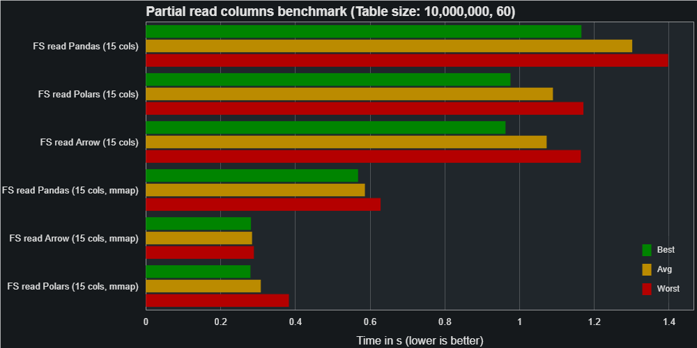

Benchmarks
==========

This page compares FeatherStore, Feather, Parquet, CSV, Pickle, and DuckDB
when reading and writing Pandas DataFrames, and shows how FeatherStore performs
across backends and partial reads.

Test setup
++++++++++

The benchmarks were run on the following hardware:

* CPU: Intel© Core™ i5-11600
* RAM: 48 GB DDR4 (3200 MHz)
* SSD: 1 TB M.2 NVMe (3470/3000 MB/s read/write)
* GPU: NVIDIA GeForce GTX 1060 6GB (not used during the benchmark)

And the following software:

* Windows 11
* Python 3.14.0
* FeatherStore 0.3.0, pandas 3.0.5, PyArrow 25.0.0, Polars 1.43.2, DuckDB 1.5.5

Each operation was run 15 times (5 repeats of 3 runs). The charts show the best,
average, and worst run, and the numbers quoted in the text are the best run.
FeatherStore used the default partition size of 128 MB and the default
``mmap`` setting, which is off on Windows, unless stated otherwise.

Compared with other libraries
+++++++++++++++++++++++++++++

The code for the format comparison is in
`benchmarks/format_comparison.py <https://github.com/hakonmh/featherstore/blob/master/benchmarks/format_comparison.py>`_.

First dataset
-------------

The first dataset is small: 6,000 random fields in a table of 1,000 rows and 6
columns. It includes strings, ints, uints, bools, floats, and datetimes, with
one column of each type.

Every format finishes in a few milliseconds, and Pickle is the fastest by a wide
margin. FeatherStore has the slowest write at 4.5 ms, and its 1.2 ms read is in
line with Parquet and DuckDB. For tables this small, a single file is the simpler choice.

Second dataset
--------------

The second dataset has 600 million random fields: 10 million rows and 60 columns
(about 6.4 GB when stored as CSV). It includes strings, ints, uints, bools,
floats, and datetimes, with 10 columns of each type.

CSV is left out of the charts because it would dwarf the other results: writing
takes 3 min 27 s and reading takes 5 min 2 s.

This is where FeatherStore is at its best. It is the fastest writer at 1.3 s,
ahead of Feather (2.5 s), Pickle (3.0 s), Parquet (11.5 s), and DuckDB (42.5 s).
Reading takes 1.4 s, slightly behind a single Feather file (1.0 s) and ahead of
Pickle (1.5 s), Parquet (6.2 s), and DuckDB (20.8 s).

Table operation benchmarks
++++++++++++++++++++++++++

The code for the table-operation benchmarks is in
`benchmarks/table_operations.py <https://github.com/hakonmh/featherstore/blob/master/benchmarks/table_operations.py>`_.
All results in this section use the second dataset.

Pandas vs Polars and Arrow
--------------------------

In addition to Pandas DataFrames, FeatherStore can read and write Polars
DataFrames and PyArrow Tables. These two structures use the Apache Arrow
Columnar Format as a memory model, so reads and writes can skip converting
to and from Pandas.

Writing takes 1.2 s from Arrow and 1.4 s from Pandas. Writing from Polars is
currently much slower at 5.4 s.

With the Windows default of ``mmap=False``, reading into Arrow (1.0 s) and Polars
(1.2 s) is only slightly faster than reading into Pandas (1.3 s). Passing
``mmap=True`` memory-maps the files instead, which cuts Arrow reads to 0.28 s and
Polars reads to 0.89 s. Pandas reads do not benefit. On Linux and macOS, ``mmap``
is on by default.

Predicate filtering
-------------------

On top of the performance of the underlying Feather files, FeatherStore
partitions data into multiple files. That lets you read part of a table without
loading all of it.

Reading a quarter of the rows with a range query (``before``, ``after``, or
``between``) takes 0.32–0.36 s, about a quarter of the 1.3 s full read, because
only the partitions that overlap the range are opened. Passing a list of
2,500,000 row labels instead takes 1.4 s, no faster than a full read.

Column selection mostly pays off with memory mapping. Without ``mmap``, reading a
quarter of the columns saves at most 20% compared with a full read. With
``mmap=True``, Pandas reads drop from 1.4 s to 0.57 s and Polars reads from
0.89 s to 0.28 s. Arrow reads take 0.28 s whether you select columns or not.

It should be noted that the performance when filtering rows is dependent
on the partition size used. Smaller partitions allow us to skip more rows
when reading, with the trade-off being slower performance when doing full table
reads and writes.
